

# Classification dans Rocket League Sideswipe

Laurent Fainsin &mdash;
Damien Guillotin &mdash;
Pierre-Eliot Jourdan

Lien vers notre [dépot gitlab](https://git.inpt.fr/tocard-inc/enseeiht/projet-classification).

Lien vers notre [dataset](https://fainsil.users.inpt.fr/content/DL/dataset.zip).

## Description

Le but de ce projet est de permettre la reconnaissance (classification) de voitures dans le jeu vidéo mobile Rocket League Sideswipe, et ce peu importe les accessoires équipés tels que les roues, les chapeaux, les stickers, les couleurs...

## Méthodolgie d'acquisition du dataset

Pour acquérir les quelque 400 000 images de notre dataset, nous avons simplement écrit un script capable d'automatiser la customisation des modèles ainsi que la prise de screenshots. Il nous aura fallu environ 18 heures pour constituer notre dataset.

Notre dataset est un dossier contenant toutes nos images et une base de données sqlite3 faisant le lien entre les noms de nos screenshots (des uuids) et les paramètres de la voiture dans l'image.

Par exemple `ec7d32da-ad24-11ec-813b-e0d4e8390134.jpg` correspond au modèle de voiture 2 (la werewolf) à la team 0 (les bleus), à la couleur primaire 50%, à la couleur secondaire 0%, au chapeau n°12 (le Rasta), au sticker n°1 (le Kana), à la roue n°4 (l'Helicoprion) et à la 3ème rotation.

Voici l'image associée:

## Méthodologie

Nous pensons dans un premier temps fractionner notre dataset de la manière suivante:

| Train | Test  | Validation |
| :---: | :---: | :--------: |
|  70%  |  15%  |    15%     |

Nous utiliserons les méthodes fournies par Tensorflow pour split notre dataset via ces proportions.

Notre objectif final serait d'utiliser l'augmentation pour obtenir plus d'un million d'images.

## Pronostic

Si l'on décide d'évaluer le réseau sur des voitures avec une rotation qui est la même que lors de l'acquisition des données, le résultat devrait être plus que correct mais si l'on évalue le réseau sur une rotation différente, c'est là que les problèmes peuvent arriver, il se peut que l'on sur-apprenne la discrétion de nos rotations.

## Chargement de nos données

Comme nous possédons un grand nombre d'images et comme celles-ci sont réliées via un csv/sqlite3, nous allons devoir utiliser une [structure spéciale](https://www.tensorflow.org/tutorials/load_data/csv#using_tfdata) de Tensorflow pour charger les images via leur association dans le csv/sqlite3, et aussi pour permettre de ne pas tout charger en mémoire (car notre dataset sera très probablement de taille supérieur à la RAM de nos machines).

## Exemple du dataset

| Rotation |         Octane          |       AfterShock        |        Werewolf         |        Breakout         |
| :------: | :---------------------: | :---------------------: | :---------------------: | :---------------------: |
|    0     | 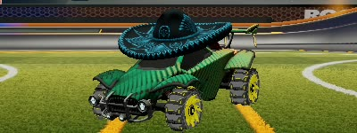 |  |  |  |
|    1     |  |  | 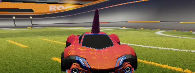 |  |
|    2     |  |  |  |  |
|    3     | 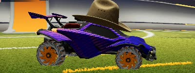 |  |  |  |
|    4     | 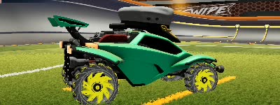 |  |  |  |
|    5     |  |  | 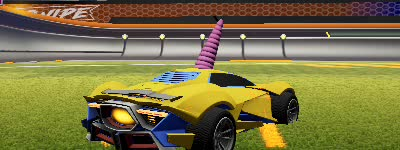 | 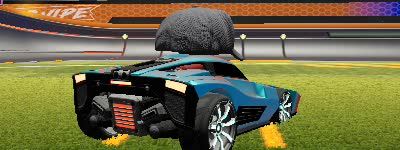 |
|    6     |  |  |  | 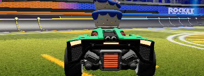 |
|    7     | 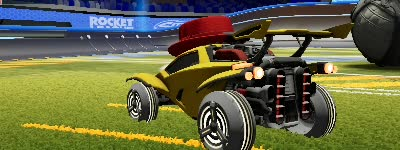 | 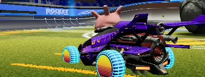 | 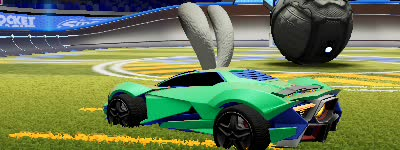 | 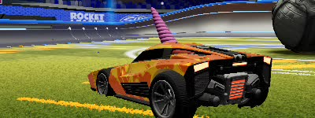 |
|    8     |  | 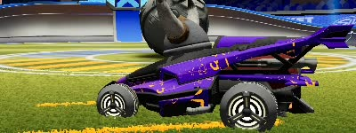 |  |  |
|    9     | 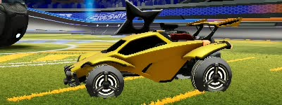 |  |  | 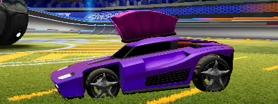 |
