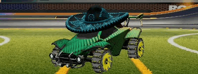
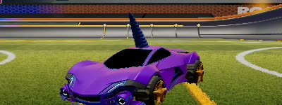
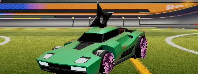
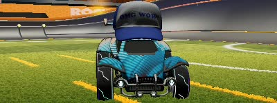
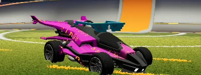
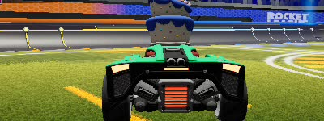
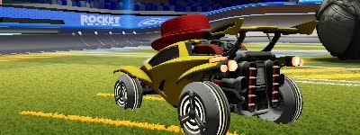
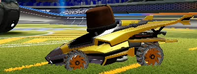

# Classification dans Rocket League Sideswipe

<p align="center">
Laurent Fainsin &mdash;
Damien Guillotin &mdash;
Pierre-Eliot Jourdan
</p>

Lien vers notre [dépot GitHub](https://github.com/Tocard-Inc/Deep-Learning).

Lien vers notre [dataset](https://fainsil.users.inpt.fr/content/DL/dataset.zip).

Lien vers notre [dataset démo](https://fainsil.users.inpt.fr/content/DL/dataset_rot.zip).

## Description

Le but de ce projet est de permettre la reconnaissance (classification) de voitures dans le jeu vidéo mobile [Rocket League Sideswipe](https://sideswipe.rocketleague.com/), et ce peu importe les accessoires équipés tels que les jantes, les chapeaux, les stickers, les couleurs...

## Méthodolgie d'acquisition du dataset

Pour acquérir les quelques 400 000 images de notre dataset, nous avons simplement écrit un script capable d'automatiser la customisation des modèles ainsi que la prise de screenshots sur un téléphone android. Il nous aura fallu environ 18 heures pour constituer notre dataset.

Notre dataset est un dossier contenant toutes nos images et une base de données sqlite3 faisant le lien entre les noms de nos screenshots (des uuids) et les paramètres de la voiture dans l'image. Nous avions prévu à l'origine d'enregistrer bien plus d'informations que la simple correspondance entre une image et le modèle de voiture, mais cette tache était trop complexe (et peu utile, quoiqu'il aurait été interessant de voir comment certains accessoires influe sur la prédiction des modèles).

Ainsi, par exemple d'après notre fichier sqlite3, `ec7d32da-ad24-11ec-813b-e0d4e8390134.jpg` correspond au modèle de voiture 2 (la werewolf) à la team 0 (les bleus), à la couleur primaire 50%, à la couleur secondaire 0%, au chapeau n°12 (le Rasta), au sticker n°1 (le Kana), à la roue n°4 (l'Helicoprion) et à la 3ème rotation.

Voici l'image associée:

<div align="center">
  
</div>

Bien qu'il vous soit théoriquement possible de reproduire la construction de ce dataset, nous le déconseillons fortement. Le jeu n'étant pas émulable, il vous faudra vous munir d'un bon téléphone capable de faire tourner le jeu, et de beaucoup beaucoup de patience. (Si Rocket League Sideswipe était disponible pour x86, générer le dataset serait bien plus simple !)

## Splitting

Nous avons fractionné notre dataset de la manière suivante:

| Train | Test  | Validation |
| :---: | :---: | :--------: |
|  80%  |  10%  |    10%     |

Nous avons choisi de batcher nos images en lots de 32. Ce qui nous donne les métriques suivantes:

```
dataset_length=380870
train_size=304696 (0.8) -> (9522 batchs)
valid_size=38087 (0.1) -> (1191 batchs)
test_size=38087 (0.1) -> (1191 batch)
```

## Chargement de nos données

Comme nous possédons un grand nombre d'images et comme celles-ci sont réliées à une base de donnéee sqlite3, nous allons devoir utiliser une [structure spéciale](https://www.tensorflow.org/tutorials/load_data/csv#using_tfdata) (pipeline) de Tensorflow pour charger les images progressivement en mémoire (car notre dataset set très probablement de taille supérieur à la RAM de notre machine).

## Exemple du dataset

<div align="center">
  
</div>

| Rotation |         Octane          |       AfterShock        |        Werewolf         |        Breakout         |
| :------: | :---------------------: | :---------------------: | :---------------------: | :---------------------: |
|    0     |  |  |  |  |
|    1     |  |  |  |  |
|    2     |  |  |  |  |
|    3     |  |  |  |  |
|    4     |  |  |  |  |
|    5     |  |  |  |  |
|    6     |  |  |  |  |
|    7     |  |  |  |  |
|    8     |  |  |  |  |
|    9     |  |  |  |  |


## Augmentation

Pour empecher l'overfitting à tout prix, nous allons utiliser l'augmentation, via la librairie albumentations (nous augmenterons uniquement nos données de training).

Nous pouvons dans un premier temps doubler gratuitement notre dataset avec un flip horizontal, en effet, par exemple, une octane vue depuis un mirroir est toujours une octane.

Ensuite, nous allons randomiser les couleurs de nos images (via la transformation ColorJitter) pour forcer notre modèle à ne pas se fier aux couleurs. Notre modèle devrait donc en toute logique se concentrer sur la structure de notre image.

Enfin, pour rendre plus robuste la reconnaisance de structure, nous allons enlever de manière aléatoire des carrés de pixels dans nos images. Cela forcera notre modèle à observer des patterns plus généraux dans nos images, plutôt que de se fier qu'à une poignée de pixels spécifiques.

Voici quelques images augmentées.


## Modèle

Nous avons choisi de créer un simple réseau convolutif. De part se nature notre réseau ne nécéssite pas beaucoups de paramètres, et donc utiliser des modèles existants pré-entrainés ralenti notre apprentissage. De plus, les features de nos images sont assez spécifiques et les modèles classiques n'y sont pas adapté.

```python
model = Sequential(
  [
    InputLayer(input_shape=RESIZED_SIZE_PIL),
    
    Conv2D(32, 3, activation="relu", kernel_regularizer=L1(REGULARIZATION_RATE)),
    MaxPooling2D(pool_size=(2, 2)),
    
    Conv2D(64, 3, activation="relu", kernel_regularizer=L1(REGULARIZATION_RATE)),
    MaxPooling2D(pool_size=(2, 2)),
    
    Conv2D(128, 3, activation="relu", kernel_regularizer=L1(REGULARIZATION_RATE), name="C2D_last"),
    MaxPooling2D(pool_size=(2, 2)),
    
    Flatten(),
    
    Dense(256, activation="relu", kernel_regularizer=L1(REGULARIZATION_RATE)),
    Dense(4, activation="softmax"),
  ]
)
```

Nous utilisons de plus une régularisation L1 (de 0.025 dans notre cas) pour réduire au maximum le nombre de poids nécéssaires. Il serait donc interessant d'essayer de réduire notre réseau à son strict nécéssaire, mais nous n'avons pas eu le temps de le faire par la suite.


```
model.summary()

_________________________________________________________________
 Layer (type)                Output Shape              Param #   
=================================================================
 conv2d_4 (Conv2D)            (None, 48, 98, 32)        896       
                                                                 
 max_pooling2d_6              (None, 24, 49, 32)        0         
 (MaxPooling 2D)                                                             
                                                                 
 conv2d_5 (Conv2D)            (None, 22, 47, 64)        18496     
                                                                 
 max_pooling2d_7              (None, 11, 23, 64)        0         
 (MaxPooling 2D)                                                             
                                                                 
 C2D_last (Conv2D)            (None, 9, 21, 128)        73856     
                                                                 
 max_pooling2d_8              (None, 4, 10, 128)        0         
 (MaxPooling 2D)                                                             
                                                                 
 flatten_2 (Flatten)          (None, 5120)              0         
                                                                 
 dense_4 (Dense)              (None, 256)               1310976   
                                                                 
 dense_5 (Dense)              (None, 4)                 1028      
                                                                 
=================================================================
Total params: 1,405,252
Trainable params: 1,405,252
Non-trainable params: 0
_________________________________________________________________
```

## Résultats

### Historique d'entrainement

Voici l'entrainement de notre réseau sur 20 epochs.
Il nous faut environ 1 minute pour une epoch, ainsi le temps totalement de l'entrainement de notre modèle est de 23 minutes.


On observe que notre loss tend vers zéro et que notre accuracy tend vers 1.
Nos résultats sont plutôt statisfaisant. On remarque cependant un écart entre notre training accuracy et notre validation accuracy, cela est surement dû à notre régularisation un peu forte, mais il est important de dire que comparer le training et la validation perd son sens dans notre cas puisque les images n'ont rien à voir.

### Matrice de confusion


Voici la matrice de confusion de notre modèle sur notre dataset.
Notre modèle se trompe donc rarement, on observer cependant qu'il aura tendance à confondre l'octane avec d'autres voitures.
(De même on se rend compte que notre dataset de test n'est pas vraiment équilibré, cela vient de la manière dont nous l'avons construit, il serait plus rigoureux de le contruire équilibré. Le même problème s'applique donc à notre dataset de validation et cela biaise surement notre apprentissage).

### Grad-cam

Pour nous permettre de mieux analyser ce qu'observe notre réseau nous avons utilisé grad-cam, qui nous donne un aperçu de ce que notre modèle observer grâce à une heatmap.


On observe alors bien que notre réseau se concentre bien sur la forme des voitures. Par exemple sur les octane vu de derrière, on remarque que celui-ci se concentre principalement sur ses phares, qui sont uniques parmis tous les autres modèles.

On remarque de même que notre modèle se concentre parfois sur le sol dessous la voiture, probablement que celui-ci n'est pas visible avec certains modèles.

Une dernière remarquer est que le modèle observe parfois le "complémentaire" de la voiture et non la voiture elle-même.

### Cas foireux

Il est intéressant de regarder les cas pour lesquels notre modèle s'est trompé dans sa classification, et d'essayer de trouver une interpretation:


Il est aussi intéressant de voir comment réagit notre modèle à des modèles de voiture qu'il n'a jamais vu (puisque la saison 2 du jeu est sortit entre temps):


## Conclusion

Ça marche bien ptdrr.

Notre notebook est entièrement reporductible, puisque tous les générateurs de nombres aléatoires ont été seedés.
